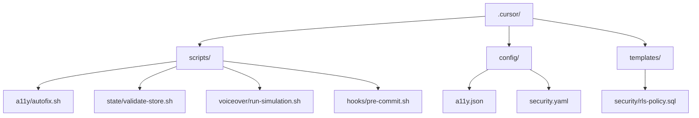
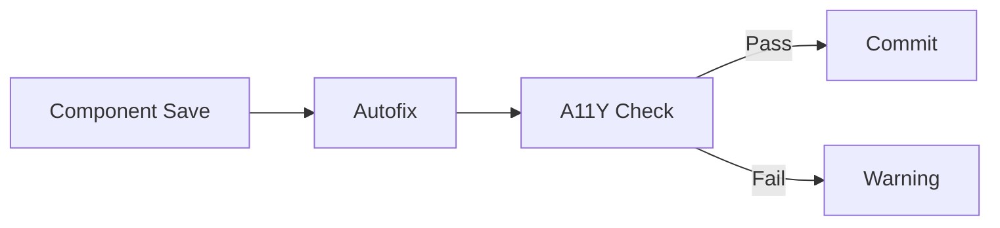
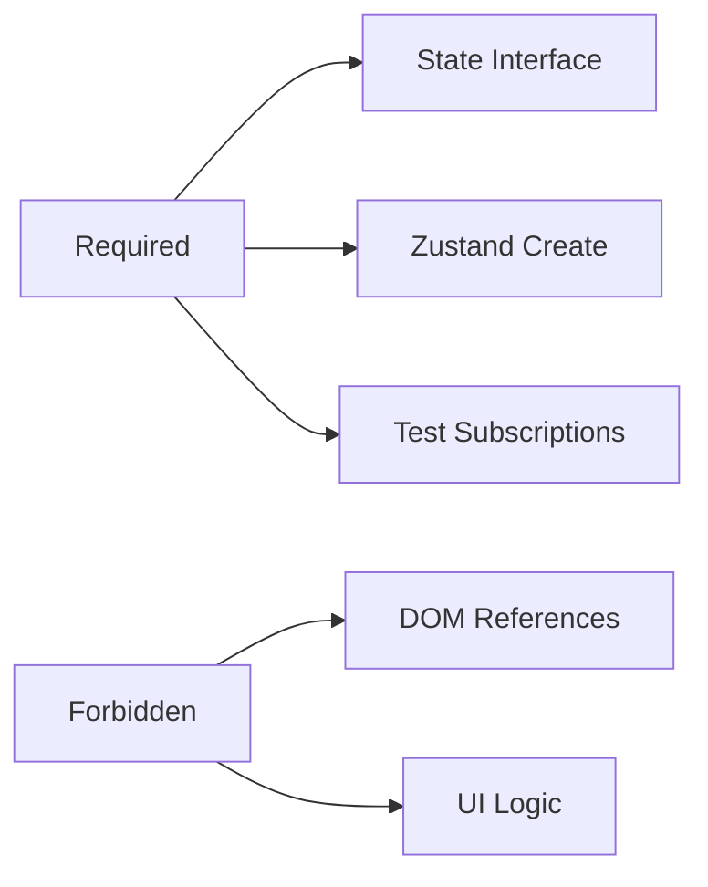
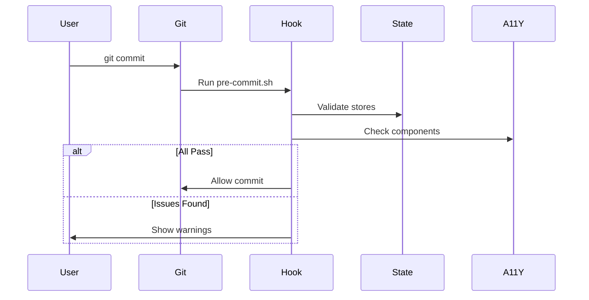

# Quality Assurance Enforcement System

## Directory Structure

```plaintext
.cursor/
├── config/
│   ├── a11y.json
│   ├── security.yaml
│   └── tests.yaml
├── scripts/
│   ├── a11y/
│   │   ├── autofix.sh
│   │   └── check.sh
│   ├── hooks/
│   │   └── pre-commit.sh
│   └── voiceover/
│       └── run-simulation.sh
├── templates/
│   ├── security/
│   │   └── rls-policy.sql
│   └── voiceover/
│       └── test-template.spec.ts
└── hooks/
    └── pre-commit.sh
```

## Setup Instructions

1. Create directory structure

    ```bash
    mkdir -p .cursor/{config,scripts/a11y,scripts/state,scripts/voiceover,templates/security,templates/voiceover,hooks}
    ```

2. Install dependencies

    ```bash
    npm install --save-dev a11y-checker @playwright/test eslint-plugin-jsx-a11y
    ```

3. Make scripts executable

    ```bash
    chmod +x .cursor/scripts/**/*.sh .cursor/hooks/*.sh
    ```

4. Add to package.json

    ```json
    {
      "scripts": {
        "a11y-autofix": "cursor run .cursor/scripts/a11y/autofix.sh",
        "security-audit": "cursor run .cursor/scripts/security/audit-rls.sh"
      }
    }
    ```

This implementation provides:

- Automated accessibility checks/fixes
- State management pattern enforcement
- Security policy validation
- Test structure maintenance
- Voiceover navigation simulation
- Pre-commit validation hooks

All rules are enforced through the configured scripts and templates while maintaining flexibility through config files.

## Overview

This system enforces frontend quality standards across accessibility, state management, security policies, and testing architecture. It combines automated checks with configurable validation rules.



## Core Components

### 1. Accessibility Enforcement (WCAG 2.1 AA)

**Paths**: `src/features/**/*.tsx`  
**Purpose**: Ensure accessible UI components  
**Key Features**:

- Auto-fix for color contrast, ARIA attributes, and image alts
- On-save validation with configurable severity
- Pre-commit hook integration



**Relevant Files**:

- Scripts: `.cursor/scripts/a11y/autofix.sh`, `.cursor/scripts/a11y/check.sh`
- Config: `.cursor/config/a11y.json`
- Hook: `.cursor/scripts/hooks/pre-commit.sh`

### 2. State Management Patterns

**Paths**: `**/*.store.ts`  
**Validation Rules**:



**Enforcement**:

- On-save validation of store files
- Pattern matching via `.cursor/scripts/state/validate-store.sh`

### 3. Security Policy Management

**Paths**: `supabase/migrations/*.sql`  
**Features**:

- Weekly RLS policy audits
- Template-based policy generation
- Mandatory security team review

**Template Example**:

```sql
.cursor/templates/security/rls-policy.sql
/* Requires review from security-team@example.com */
create policy "user_data_access"
on profiles for SELECT
using (auth.uid() = user_id);
```

### 4. Test Architecture Standards

**Config**: `.cursor/config/tests.yaml`  
**Structure**:

```yaml
unit:
  path: __tests__/unit/**
  failureThreshold: 10 # Max allowed failures

e2e:
  schedule: "0 0 * * *" # Daily CI runs
  excludeFromHooks: true
```

### 5. Voiceover Simulation

**Paths**: `**/keyboard/**/*.spec.ts`  
**Validation**:

- Tab order flow
- Escape key handling
- Arrow navigation

**Test Template**:

```typescript
.cursor/templates/voiceover/test-template.spec.ts
test('Tab order flow', async ({ page }) => {
  await page.keyboard.press('Tab');
  // Assertions here
});
```

## Workflow Integration

### Pre-Commit Hook



## File Reference

| Purpose | Location |
|---------|----------|
| Accessibility config | `.cursor/config/a11y.json` |
| Security rules | `.cursor/config/security.yaml` |
| Store validation | `.cursor/scripts/state/validate-store.sh` |
| Policy templates | `.cursor/templates/security/` |
| Voiceover tests | `.cursor/scripts/voiceover/run-simulation.sh` |

## Customization

### Modify A11Y Rules

Edit `.cursor/config/a11y.json`:

```json
{
  "autoFix": {
    "enabled": ["color-contrast", "aria-required"],
    "disabled": ["focus-order"]
  }
}
```

### Update Security Reviewers

Edit `.cursor/config/security.yaml`:

```yaml
autoGen:
  reviewers:
    - security-lead@example.com
    - senior-dev@example.com
```

### Adjust Test Thresholds

Modify `.cursor/config/tests.yaml`:

```yaml
unit:
  failureThreshold: 15 # Increase allowed failures
```

## Troubleshooting

| Issue | Solution |
|-------|----------|
| A11Y warnings on commit | Run `npm run a11y-autofix` |
| Store validation fails | Check `.cursor/scripts/state/validate-store.sh` patterns |
| Policy review missing | Verify template header in `rls-policy.sql` |
| Voiceover test failures | Use Playwright debug mode |

This system creates quality guardrails while allowing team-specific customization through config files and templates.
