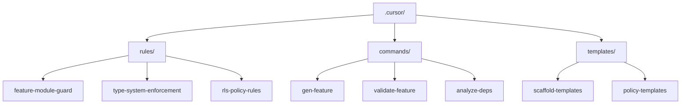
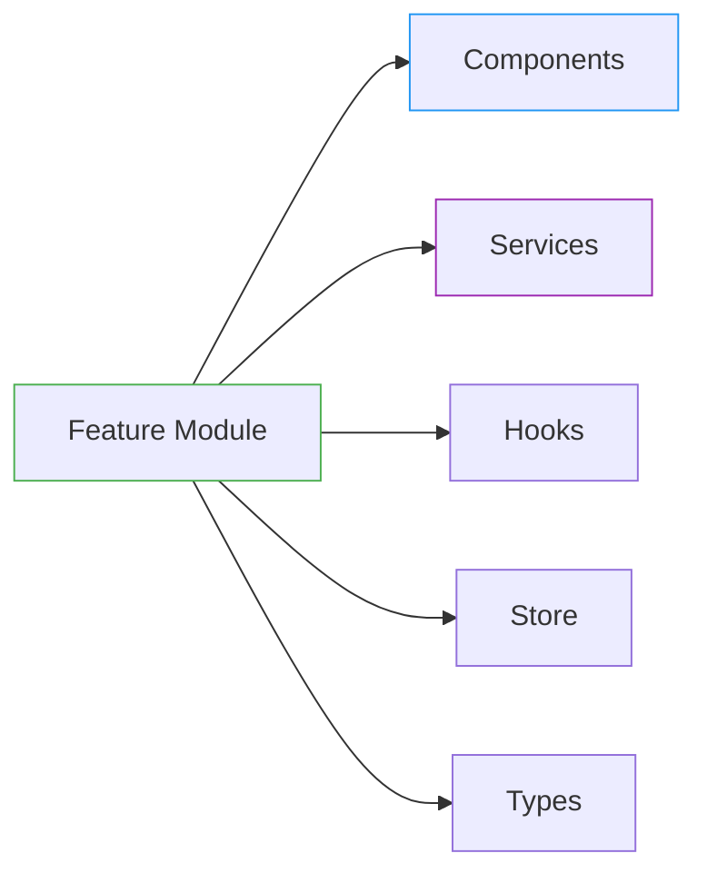
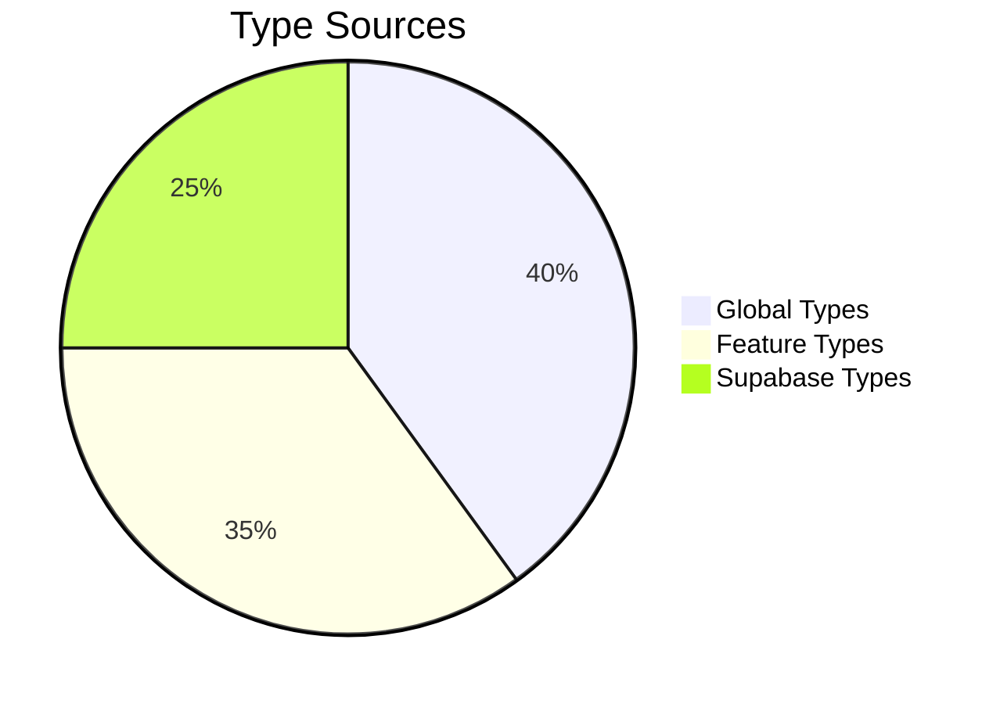
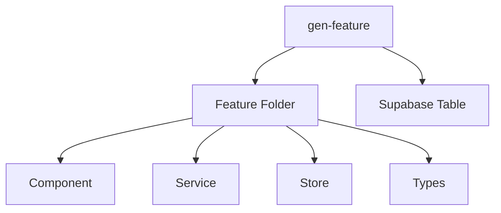
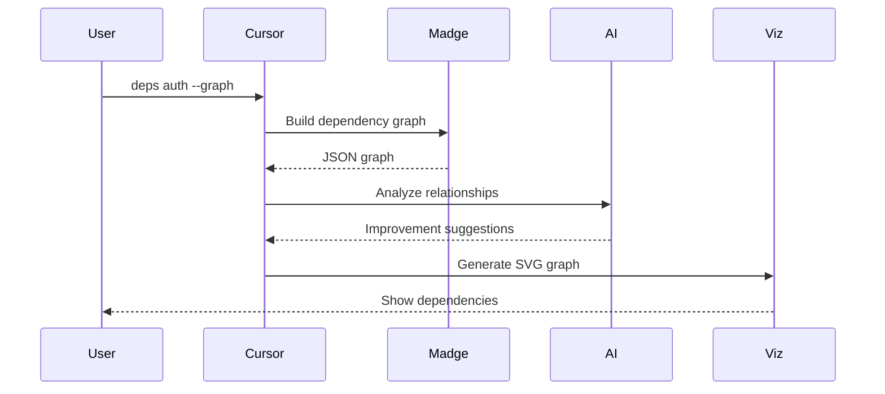
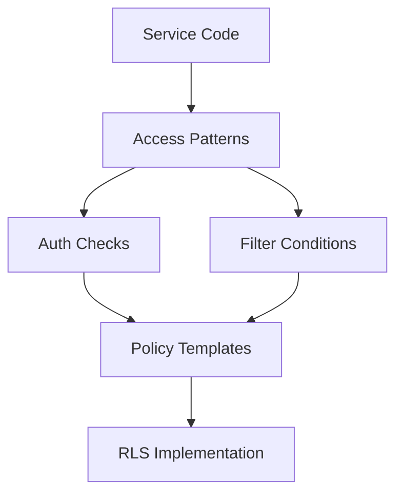

# Architecture Enforcement System

## Setup Instructions

1. Create directories:

```bash
mkdir -p .cursor/{config,scripts/deps,scripts/types,scripts/supabase,templates/feature,templates/policies}
```

Make scripts executable:

```bash
chmod +x .cursor/scripts/**/*.sh
```

Add TypeScript type sync command to package.json:

```json
{
  "scripts": {
    "supabase:types": "supabase gen types typescript --local > src/types/database.types.ts"
  }
}
```

This implementation provides

- Reusable templates for feature scaffolding
- Configurable validation rules
- Modular scripts for complex operations
- Type-safe policy generation
- Enforcement of architectural boundaries

## Overview

This system enforces a modular feature-based architecture with strict type safety and database security rules. It combines automated scaffolding, dependency analysis, and policy generation.



## Core Rules

### 1. Feature Module Guard

**Paths**: `src/features/**/*`  
**Purpose**: Maintain clean feature boundaries  



**Enforced Structure**:

- `components/`: PascalCase React components
- `services/`: Class-based services with PascalCase
- `hooks/`: `useCamelCase` custom hooks
- `store/`: Zustand store with camelCase
- `types/`: Type definitions in `*.types.ts`

**Boundary Checks**:

1. No direct imports between features
2. Public API via `index.ts` exports
3. State sharing through stores only

### 2. Type System Enforcement

**Paths**: `**/*.ts`  
**Type Sources**:



**Validation Rules**:

- ❌ Error on duplicate type definitions
- ⚠️ Warn on missing types
- Auto-sync Supabase types after migrations

### 3. RLS Policy Rules

**Paths**: `supabase/migrations/*.sql`  
**Security Requirements**:

```mermaid
flowchart TB
    P[RLS Policy] -->|Must Include| A[auth.uid()]
    P -->|Validate| R[Role Checks]
    P -->|Prevent| C[Circular Dependencies]
```

**Policy Patterns**:

- Maximum dependency depth: 2
- Required auth references in SELECT
- Explicit role checks for mutations

---

## Command Reference

### 1. Generate Feature Module

```bash
gen-feature <name> [--supabase]
```

**Scaffolding Structure**:



**File Templates**:

- Component: `Feature$1.tsx`
- Service: `$1Service.ts`
- Store: `$1.store.ts`
- Types: `$1.types.ts`

**Supabase Integration**:

- Creates dated migration file
- Auto-enables RLS
- Table structure template

### 2. Validate Feature

```bash
validate-feature <name>
```

**Validation Checks**:

1. Public API surface audit
2. Cross-feature dependency detection
3. Store communication patterns
4. Type definition completeness

**Output Format**:

```markdown
## $1 Feature Audit
### Public API
- Valid Exports: components, hooks, types
- Leaked Internals: services/internal

### Dependencies
- Feature Imports: auth, shared
- Supabase Integration: 15 queries

### Type Safety
- Global Type Usage: 2
- Missing Types: searchParams
```

### 3. Analyze Dependencies

```bash
deps <feature> [--graph]
```

**Pipeline Steps**:



### 4. Type Migration

```bash
migrate-type <type> <from> <to> [--force]
```

**Migration Process**:

1. Safety checks
2. Import refactoring
3. File relocation
4. Post-validation

### 5. Generate RLS Policies

```bash
gen-rls <feature> [--table]
```

**Policy Generation Flow**:

1. Analyze service patterns
2. Identify access requirements
3. Generate SQL policy templates
4. Check for circular dependencies



---

## Customization Guide

### Modify Feature Templates

Edit scaffold templates in `.cursor/templates/feature-scaffold/`:

```bash
.cursor/
└── templates/
    └── feature-scaffold/
        ├── component.tpl
        ├── service.tpl
        └── migration.sql.tpl
```

### Extend Type Rules

Update type sources in `cursorrules.json`:

```json
"typeSources": {
  "newSource": "@/lib/types/*.d.ts"
}
```

### Add Policy Templates

Create new RLS templates in `.cursor/templates/policies/`:

```jinja2
<!-- read-policy.tpl -->
create policy "{{name}}_read_access"
on {{table}} for SELECT using (
  {{#if public}}true{{else}}
  auth.role() = '{{role}}' {{/if}}
);
```

---

## Troubleshooting

| Issue | Solution |
|-------|----------|
| Circular dependencies | Use `analyze-deps --graph` to visualize |
| Missing types | Run `npm run supabase:types` |
| RLS policy conflicts | Check migration order |
| Feature boundary violations | Validate with `validate-feature` |

## File Reference

| Component | Location |
|-----------|----------|
| Core Rules | `.cursor/cursorrules.json#rules` |
| Scaffolding | `.cursor/commands/gen-feature` |
| Type Config | `.cursor/rules/type-system-enforcement` |
| Policy Templates | `.cursor/templates/policies/` |

This system creates a robust architecture foundation while maintaining flexibility through customizable templates and rules.
