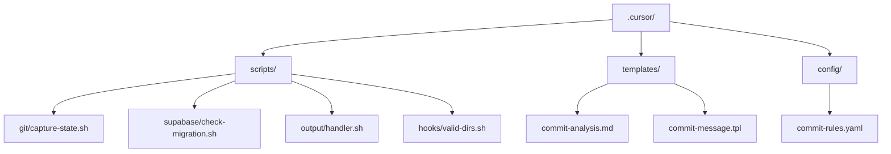
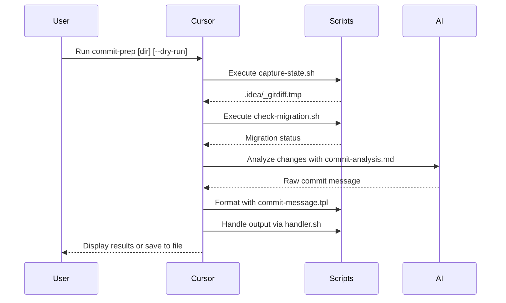

# Cursor Workflow Automation Documentation

## Overview

This system automates commit message generation while enforcing project-specific rules. It integrates with Git, checks for Supabase migrations, and follows Conventional Commits standards.

**Key Features**:

- 🛠️ AI-powered commit message generation
- 🔒 Validation checks for Supabase migrations
- 📂 Directory structure validation
- 📝 Conventional Commits compliance
- 🧩 Modular script architecture

## Directory Structure



## Core Components

### 1. Command Pipeline (`commit-prep`)

**Location**: `cursorrules.json`  
**Purpose**: Orchestrate the commit preparation workflow  
**Steps**:

1. `capture-git-state`: Snapshots Git changes
2. `supabase-migration-check`: Validates database migrations
3. `analyze-changes`: AI-generated commit message
4. `format-output`: Template-based formatting
5. `output-handling`: Dry-run vs actual output

### 2. Scripts

| Script | Location | Purpose |
|--------|----------|---------|
| `capture-state.sh` | `scripts/git/` | Capture Git diff and status |
| `check-migration.sh` | `scripts/supabase/` | Verify Supabase migrations |
| `handler.sh` | `scripts/output/` | Manage output destination |
| `valid-dirs.sh` | `scripts/hooks/` | List valid directories |

### 3. Templates

| Template | Location | Purpose |
|----------|----------|---------|
| `commit-analysis.md` | `templates/` | AI prompt structure |
| `commit-message.tpl` | `templates/` | Commit message format |

### 4. Configuration

| Config | Location | Purpose |
|--------|----------|---------|
| `commit-rules.yaml` | `config/` | Commit type definitions & rules |

## Workflow Explanation



## Setup Guide

1. Create directory structure

  ```bash
  mkdir -p .cursor/{scripts/git,scripts/supabase,scripts/output,scripts/hooks,templates,config}
  ```

2. Create script files from provided content

3. Set execute permissions

  ```bash
  chmod +x .cursor/scripts/**/*.sh
  ```

4. Add template files:

  ```bash
  # Create templates
  touch .cursor/templates/commit-analysis.md .cursor/templates/commit-message.tpl
  ```

5. Configure commit rules:

  ```bash
  # Create config
  touch .cursor/config/commit-rules.yaml
  ```

## Customization

### Modify Commit Types

Edit `config/commit-rules.yaml`:

```yaml
feat:
  description: "New user-facing functionality"
  requireScope: true
  exampleScopes: ["auth", "checkout", "dashboard"]
```

### Add Valid Directories

Update `scripts/hooks/valid-dirs.sh`:

```bash
# Only include specific directories
echo "src public supabase/migrations"
```

### Extend with Hooks

Add pre/post hooks in `cursorrules.json`:

```json
"hooks": {
  "preExecute": ".cursor/scripts/custom/pre-commit.sh",
  "postSuccess": ".cursor/scripts/custom/cleanup.sh"
}
```

### ESLint Integration

Create formatting hook:

```bash
# .cursor/scripts/style/format.sh
#!/bin/bash
eslint --fix "$1"
```

## Troubleshooting

| Error | Solution |
|-------|----------|
| `ERR_INVALID_DIR` | Check valid directories with `commit-prep --list-dirs` |
| `ERR_MISSING_MIGRATION` | Create new Supabase migration file |
| `ERR_NOT_GIT_REPO` | Run from Git repository root |
| Template validation fails | Check `commit-message.tpl` syntax |

## File Reference

| Purpose | File Location |
|---------|---------------|
| Main configuration | `.cursor/cursorrules.json` |
| Git integration | `.cursor/scripts/git/capture-state.sh` |
| Supabase checks | `.cursor/scripts/supabase/check-migration.sh` |
| Commit rules | `.cursor/config/commit-rules.yaml` |
| AI prompt template | `.cursor/templates/commit-analysis.md` |
