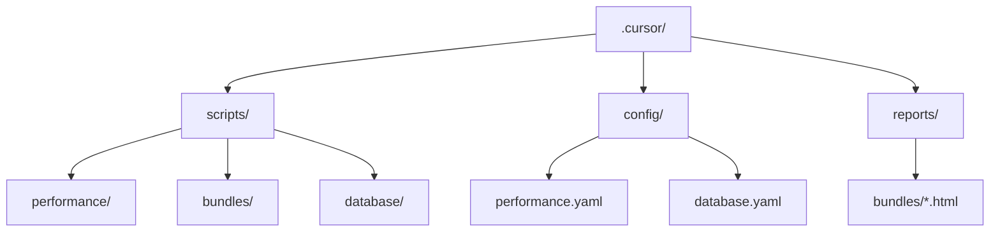
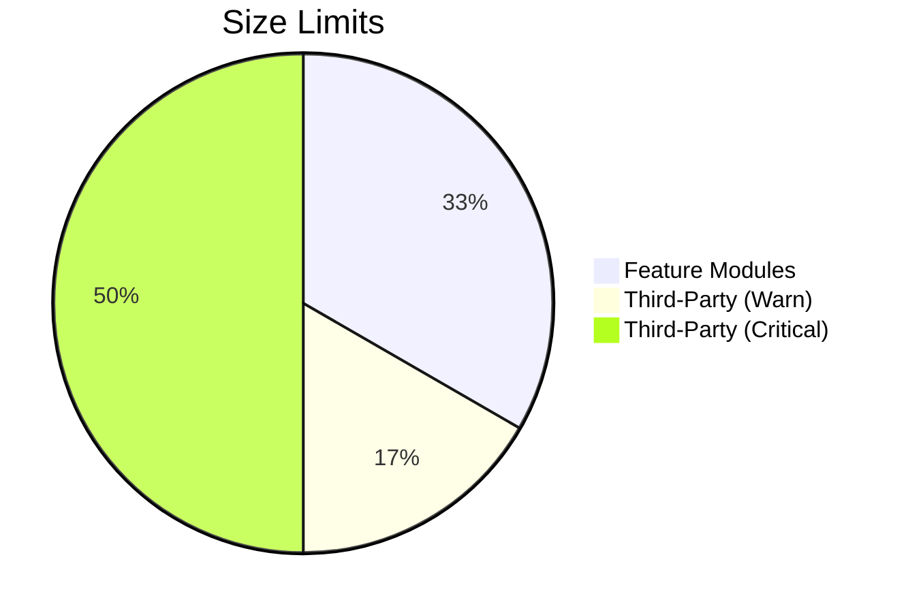
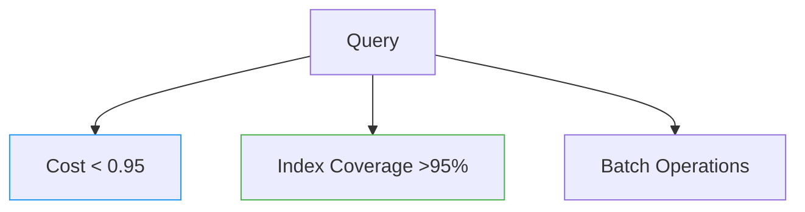
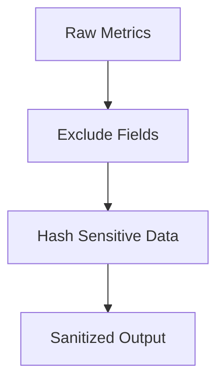
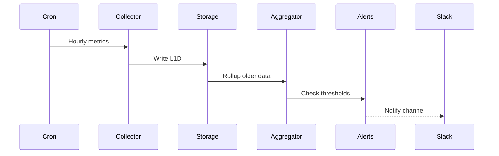

# Performance & Quality Enforcement System

## Directory Structure

```plaintext
.cursor/
├── config/
│   ├── performance.yaml
│   ├── bundles.yaml
│   ├── dependencies.yaml
│   ├── database.yaml
│   └── security.yaml
├── scripts/
│   ├── performance/
│   │   ├── collect-metrics.sh
│   │   └── check-thresholds.sh
│   ├── bundles/
│   │   └── analyze-bundles.sh
│   ├── dependencies/
│   │   └── check-deps.sh
│   ├── database/
│   │   ├── analyze-sql.sh
│   │   └── auto-index.sh
│   └── security/
│       └── sanitize-metrics.sh
└── reports/
    ├── bundles/
    └── dependency-analysis.md
```

## Setup Instructions

1. Create directory structure

    ```bash
    mkdir -p .cursor/{config,scripts/performance,scripts/bundles,scripts/dependencies,scripts/database,scripts/security,reports/bundles}
    ```

2. Install required tools

    ```bash
    npm install -g source-map-explorer jq yq
    ```

3. Make scripts executable

    ```bash
    chmod +x .cursor/scripts/**/*.sh
    ```

4. Add cron jobs for scheduled tasks

    ```bash
    # Daily bundle analysis
    0 0 * * * .cursor/scripts/bundles/analyze-bundles.sh

    # Metrics collection every hour
    0 * * * * .cursor/scripts/performance/collect-metrics.sh
    ```

This implementation provides:

- Performance metric tracking with retention policies
- Bundle size enforcement with third-party monitoring
- Dependency impact analysis with migration suggestions
- SQL query optimization checks
- Security-conscious metric sanitization
- Automated reporting and threshold alerts

All components are configurable through YAML files and integrate with existing build processes.

## Overview

This system monitors and enforces performance metrics, bundle size limits, dependency health, database optimization, and security sanitization across the codebase.



## Core Components

### 1. Performance Metrics Tracking

**Purpose**: Monitor critical performance indicators with retention policies  
**Key Features**:

- Multi-tiered data retention (24h → 90d)
- Threshold-based alerts (warning/critical)
- Historical trend analysis (WoW/Wo4W)


**Relevant Files**:

- Collection: `.cursor/scripts/performance/collect-metrics.sh`
- Thresholds: `.cursor/config/performance.yaml`
- Data: `.cursor/performance/history/`

### 2. Bundle Size Enforcement

**Paths**: `src/**/*`  
**Rules**:



**Enforcement**:

- Daily automated analysis
- HTML/JSON reporting
- Third-party dependency monitoring

**Script**: `.cursor/scripts/bundles/analyze-bundles.sh`

### 3. Dependency Health Checks

**Strategy**: Suggest alternatives for heavy dependencies  
**Report Format**:

```text
High impact: lodash (350KB)
Consider: lodash-es, individual methods
Install: npm install lodash-es
Migration effort: 2 hours
Size reduction: 210KB
```

**Paths**:

- Analysis: `.cursor/scripts/dependencies/check-deps.sh`
- Output: `.cursor/reports/dependency-analysis.md`

### 4. Database Optimization

**Paths**: `supabase/**/*.sql`  
**Rules**:



**Features**:

- Auto-indexing with code review
- Batch operation pattern enforcement
- EXPLAIN ANALYZE validation

**Script**: `.cursor/scripts/database/analyze-sql.sh`

### 5. Security Sanitization

**Data Handling**:



**Process**:

- Remove user identifiers
- Hash query patterns
- Validate dependency sources

**Script**: `.cursor/scripts/security/sanitize-metrics.sh`

## File Structure

```plaintext
.cursor/
├── config/
│   ├── performance.yaml       # Metric thresholds
│   ├── bundles.yaml           # Size limits
│   ├── database.yaml          # Query rules
│   └── security.yaml          # Sanitization rules
├── scripts/
│   ├── performance/           # Metric collection
│   ├── bundles/               # Size analysis
│   ├── database/              # SQL optimization
│   └── security/              # Data sanitization
└── reports/
    ├── bundles/               # HTML/JSON reports
    └── dependency-analysis.md # Migration suggestions
```

## Workflow Integration

### Performance Monitoring



### Bundle Analysis

```bash
0 0 * * * /path/to/.cursor/scripts/bundles/analyze-bundles.sh
```

## Customization

### Adjust Size Limits

Edit `.cursor/config/bundles.yaml`:

```yaml
sizeLimits:
  featureModules: "250KB"
  thirdParty:
    warningThreshold: "150KB"
    criticalThreshold: "350KB"
```

### Modify Query Rules

Update `.cursor/config/database.yaml`:

```yaml
queryRules:
  explainAnalysis:
    maxCost: 1.25
  batchOperations:
    minRows: 500
```

## Troubleshooting

| Issue | Solution |
|-------|----------|
| High bundle size | Run `analyze-bundles.sh --detail` |
| Query cost alerts | Check `.cursor/reports/query-analysis/` |
| Dependency warnings | Review `dependency-analysis.md` |
| Metric gaps | Verify cron jobs are running |

This system creates proactive quality guardrails while providing actionable insights through automated reports and thresholds. All components are configurable to match evolving project requirements.
